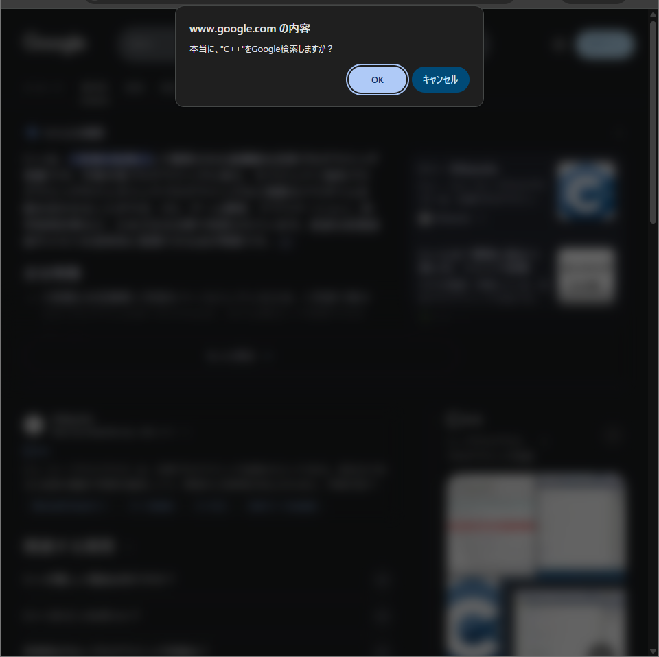

# Do-you-really-want-to-Google-it

Google検索時に、confirmを表示するスクリプト

 
 

## 挙動
Google検索をすると、本当に検索するかconfirmが表示されます。    
OKを押すと、検索結果が表示され、キャンセルを押すと、[google.com](google.com)にリダイレクトされます。

## 用途
ネットサーフィンのやりすぎの抑止力にお使いください。

## ⬇️ インストール
[greasyfork](https://greasyfork.org/ja/scripts/553071-do-you-really-want-to-google-it)のページからインストールしてください。    
Tampermonkeyなどのユーザースクリプト実行アドオンが別途必要です。    

## ✍ Author

[PenguinCabinet](https://github.com/PenguinCabinet)
